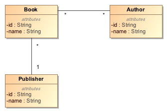
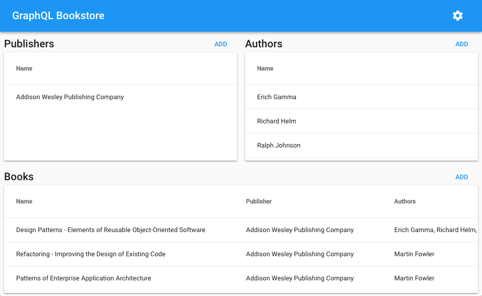

GraphQL MobX Bookstore Client
=============================
This example demonstrates the patterns used in real-world GraphQL applications and how to implement them using [Apollo Link](https://www.apollographql.com/docs/link/) and MobX.

1. In any realistic application, you will encounter one-to-many and many-to-many relationships between domain entities. In this example, we use the bookstore domain to illustrate how to implement these relationships.
2. In many applications, there is a need to show real-time updates on the client. We demonstrate how to do this using GraphQL subscriptions.

First, a quick description of the bookstore domain:

- A bookstore sells books.
- A book can have one or more authors.
- A book has a single publisher.
- An author can write several books.
- A publisher can publish several books.

More formally, book-to-author is a many-to-many relationship, whereas book-to-publisher is a many-to-one relationship. This is depicted in the domain model below.



Getting started (Dev Mode)
--------------------------
First build and run the [GraphQL Bookstore Server](https://github.com/archfirst/graphql-bookstore-server).

Then execute the following commands to run the application in development mode:

```bash
$ npm install
$ npm start
```

Now point your browser to http://localhost:3000/. You should see the following UI:



Building for production
-----------------------
When you want to deploy the application into production, run the following command:

```bash
$ npm run build
```

The deployable application will be built in the `build` folder.
